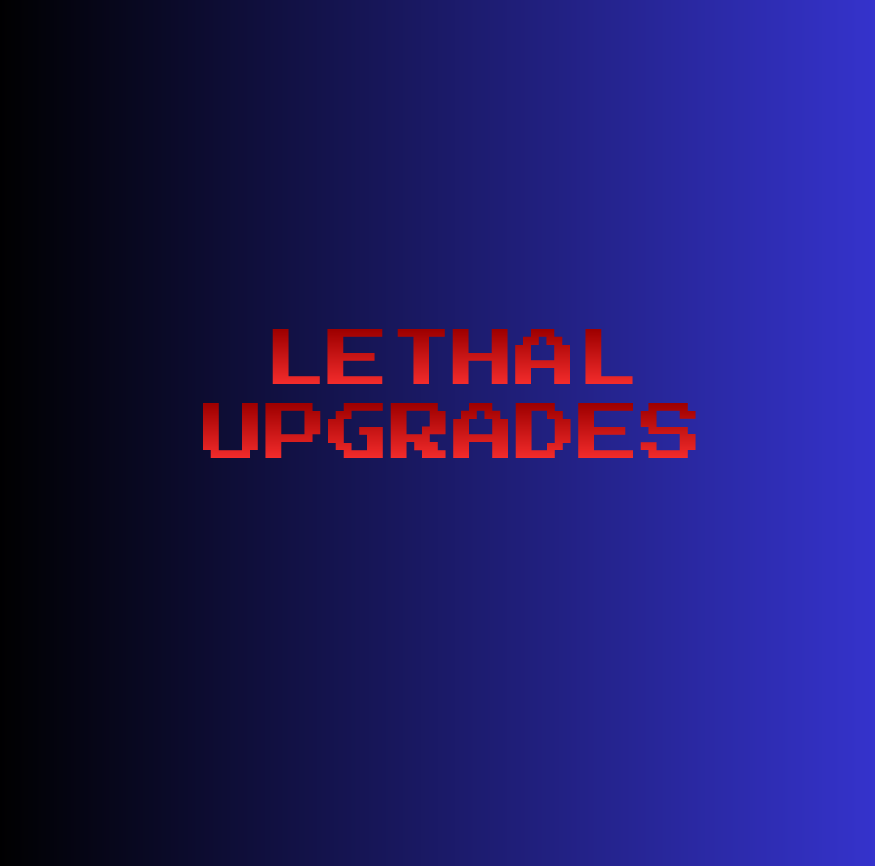

  

The upgrades so far are as follows:

Health
- Tier 1: Gain +20 additional health. [DONE]
- Tier 2: Reduce all incoming damage by 5%. [DONE]
- Tier 3: Gain +30 additional health. [DONE]

Stamina
- Tier 1: Decrease running stamina usage. [DONE] 
- Tier 2: Improve stamina regen by 10%.
- Tier 3: Reduced stamina consumption when heavy (>=50 lbs) by 50%. 

Movement
- Tier 1: Sprint 6% faster. [DONE]
- Tier 2: Walk/Crouch 12% faster. [DONE]
- Tier 3: Increased jump height by 25%. [DONE]

Utilities
- Tier 1: Increase all battery capacities by 10%.
- Tier 2: Reduce cost of all store items by 10%. 
- Tier 3: Flashlight items can pass through the inverse teleporter.

Legendaries (Acquired with tokens)
- Health: Gain an adaptive regeneration abality.
    + If you are below 50% health, gain +0.5 hp/s regen until back up to 50%.
    + If you are below 100% but above 50% health and have not taken damage again 20 seconds after the first time, gain a passive + 2 hp/s buff until back up to 100%. Can be stopped if taking damage again.
- Stamina: When damaged, regardless of amount or source, gain full stamina back.
- Movement: While critically injured, become invisible
- Utilities: All equipment weighs 0 pounds.